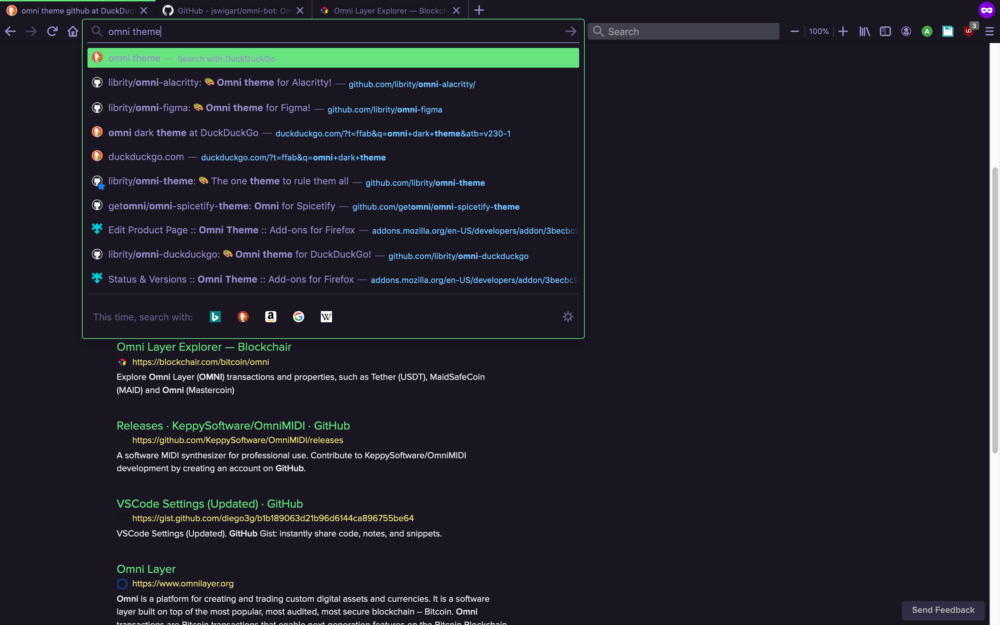

# Omni for [Firefox](https://www.mozilla.org/firefox)

> 🎨 Omni is everywhere [Firefox](https://www.mozilla.org/firefox)

## Installation Instructions

You can easily install this theme using the new [Firefox Color](https://github.com/mozilla/FirefoxColor/) extension:

1. Install the extension from the [official add-ons marketplace](https://addons.mozilla.org/en-US/firefox/addon/firefox-color/).
2. Click on [this link](https://color.firefox.com/?theme=XQAAAAJ8BAAAAAAAAABBKYhm849SCicxcUhA3DJozHnOMuotJJEte8PyMHXEBH_1Bqs1SAkozO9VT_PfUZZfZ5L3EVpllMPhVRmZ8L7GDVs28c3aEU1KCzfnjTylZZWmJa0mi02T6ZZQTwvTmkH7h1A2K8vsy1N4I28HLHewCrky17mYe5dmzBmm-s9byFTbycDLNAu2n1AAx6INvMuuv9-IbRZX1XZjSODbOz6-FBUr5BOE9lcOG3ju-CmQjczUwoqsNtTIfmsoQUd9ZVV2PGBgszKCNBwck9esSl7VCSKKKie0HhS-HF9j_1hPakSq4VLVUiWJrOR7fuSe043NiTrVCq1I_iTcFEHalgwt26OQodaIWg0ZhAqjjRf6JZk1WK6nExrx6lEsVc7PnWxX81G0qKDUcPsjNq0iyV9MCLIXFkaPLK5mJEec1FVF-Z49YdlHEAoiCj8AjIu7aV4szzz7iI4nj6s50MCcY8awIe7z0Cn25Uzu5mCxVtfpjaTqI-DAS4IJHBk_bBo4xtjQuqxG2ubr2aT3LTYRbiMfF2ZrgBn6GEdc4UehUeu4ANz_lQaPaw) to add it to your library, then apply it to your browser.
